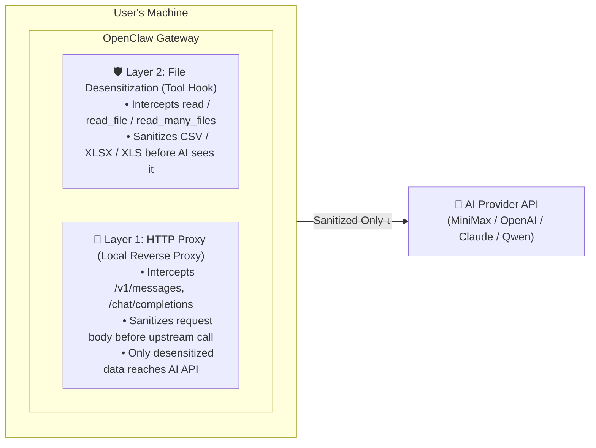

# Data Guard - AI Data Privacy Shield

> A dual-layer data desensitization plugin for OpenClaw. Zero data leakage, pure local processing.

---

## 🛡️ Overview | 概述

**Data Guard** is an OpenClaw plugin that provides enterprise-grade privacy protection for AI interactions. It intercepts and sanitizes sensitive data before it leaves your machine, ensuring AI APIs never receive raw personal information.

| 属性 | 值 |
|------|-----|
| **Version** | 2.0.0 |
| **Type** | OpenClaw Plugin |
| **Engine** | Pure Node.js (Zero External Dependencies) |
| **Platform** | macOS / Linux / Windows |
| **License** | MIT |

---

## 🔒 Architecture | 架构设计



### Dual-Layer Protection | 双层防护机制

| Layer | Trigger | Mechanism | Coverage |
|-------|---------|------------|----------|
| **L1: HTTP Proxy** | `POST /v1/*` | Local reverse proxy on port 47291 | All API messages |
| **L2: Tool Hook** | `before_tool_call` | File content sanitization | CSV / XLSX / XLS |

---

## 🎯 Supported Data Types | 支持的脱敏类型

### 25 Categories of Sensitive Data | 25类敏感数据类型

| Category | Patterns | Example |
|----------|----------|---------|
| 手机号 / Phone | `1[3-9]\d{9}` | `13812345678` → `138****5678` |
| 身份证号 / ID Card | 18-digit Chinese ID | `110101199001011234` → `1101***********1234` |
| 银行卡号 / Bank Card | 16-19 digit cards | `6222021234567890123` → `622202**********0123` |
| 邮箱 / Email | Standard email format | `user@example.com` → `u**@e******.com` |
| IP地址 / IP Address | IPv4/IPv6 | `192.168.1.100` → `192.168.*.*` |
| 护照号 / Passport | P + 8-9 digits | `E12345678` → `E********` |
| 发票号码 / Invoice | Various formats | `FP1234567890` → `FP***********` |
| 订单号 / Order ID | Various formats | `DD2023123456789` → `DD*************` |
| 社保卡号 / SSN | 18-digit | `123456789012345678` → `**************5678` |
| ... | ... | ... |

### Column-Level Desensitization | 列级精准脱敏

For structured files (CSV/XLSX), the plugin identifies sensitive columns by header names:

```csv
# Input (AI never sees this)
姓名,手机号,身份证号,银行卡号,邮箱,家庭住址
张明伟,13812345678,110101199001011234,6222021234567890123,zhang@example.com,北京市朝阳区

# Output (AI receives sanitized data)
姓名,手机号,身份证号,银行卡号,邮箱,家庭住址
张**,138****5678,1101***********1234,6222**********90123,z**@e******.com,北京市朝阳区
```

---

## 📦 Installation | 安装

### Prerequisites | 前置要求

- Node.js >= 18
- OpenClaw Gateway

### Quick Install | 快速安装

```bash
# Method 1: via OpenClaw CLI (Recommended)
openclaw plugins install openclaw-plugins-data-guard

# Method 2: via npm
npm install -g openclaw-plugins-data-guard

# Method 3: via source
git clone https://github.com/your-org/openclaw-plugins-data-guard.git
cd openclaw-plugins-data-guard
npm install
openclaw plugins install .
```

### Verify Installation | 验证安装

```bash
openclaw plugins list
# Should show: openclaw-plugins-data-guard

openclaw gateway restart
```

---

## ⚙️ Configuration | 配置

### Environment Variables | 环境变量

| Variable | Default | Description |
|----------|---------|-------------|
| `DATA_GUARD_PORT` | `47291` | Proxy listening port |
| `DATA_GUARD_BLOCK_ON_FAILURE` | `true` | Block request on desensitization error |
| `OPENCLAW_DIR` | `~/.openclaw` | OpenClaw config directory (auto-detect on Windows) |

### Example | 示例

```bash
# Custom port
DATA_GUARD_PORT=47292 openclaw gateway restart

# Fail-open mode (not recommended)
DATA_GUARD_BLOCK_ON_FAILURE=false openclaw gateway restart
```

---

## 🎬 Usage Scenarios | 使用场景

### 1. Financial Research | 金融投研

```csv
# Researcher analyzes customer database
客户姓名,交易账号,身份证号,手机号,开户行,账户余额
李明,6222020012345678901,110101198801011234,13912345678,工商银行,¥1,250,000
```

**Data Guard Output:**
```csv
客户姓名,交易账号,身份证号,手机号,开户行,账户余额
李**,6222**********78901,1101***********1234,139****5678,工商银行,¥1,250,000
```

### 2. Medical Records | 医疗数据

```csv
# Doctor analyzes patient records
姓名,病历号,身份证,手机号,诊断结果,处方药物
王芳,BL2023001234,310101199005052345,13800001111,糖尿病,二甲双胍500mg
```

**Data Guard Output:**
```csv
姓名,病历号,身份证,手机号,诊断结果,处方药物
王*,BL***********,3101***********5345,138********11,糖尿病,二甲双胍500mg
```

### 3. Customer Analytics | 客户分析

```csv
# Analyst processes user database
用户ID,昵称,手机号,邮箱,注册时间,消费金额
U12345,数据控,13812345678,user_123@email.com,2023-01-15,¥8,888.00
```

**Data Guard Output:**
```csv
用户ID,昵称,手机号,邮箱,注册时间,消费金额
U12345,数据控,138****5678,u**@e*****.com,2023-01-15,¥8,888.00
```

### 4. Legal Document Review | 法律文书

```csv
# Lawyer reviews contract
甲方姓名,身份证号,联系电话,银行账号,地址,签署日期
张总,120101197001011234,13912345678,6222021234567890,天津市和平区,2023-12-01
```

**Data Guard Output:**
```csv
甲方姓名,身份证号,联系电话,银行账号,地址,签署日期
张*,1201***********234,139****5678,6222**********7890,天津市和平区,2023-12-01
```

---

## 🔧 Supported Use Cases | 适用场景

| Industry | Use Case | Benefit |
|----------|----------|---------|
| **Finance / 金融** | Customer database analysis | Protect account numbers, transaction IDs |
| **Investment Research / 投研** | Market data processing | Sanitize corporate identifiers, trading codes |
| **Healthcare / 医疗** | Patient record analysis | Protect medical record numbers, prescriptions |
| **Legal / 法律** | Contract review | Mask party identities, account details |
| **Insurance / 保险** | Claim processing | Sanitize policy numbers, claimant info |
| **E-commerce / 电商** | Order data analysis | Protect customer contact information |
| **HR / 人力资源** | Payroll processing | Mask employee IDs, salary information |
| **Government / 政府** | Citizen database | Protect ID numbers, addresses |

---

## 🧪 Technical Specifications | 技术规格

### Performance | 性能

| Metric | Value |
|--------|-------|
| Latency Overhead | < 5ms per request |
| Memory Footprint | ~50MB |
| File Processing | Up to 100MB CSV/XLSX |

### Security | 安全性

- **Zero External Dependencies**: Pure Node.js, no third-party desensitization libraries
- **Local-Only Processing**: All data stays on your machine
- **Fail-Safe Default**: `BLOCK_ON_FAILURE=true` prevents data leakage on errors
- **No Data Persistence**: Temporary files are deleted immediately after processing

### Compatibility | 兼容性

| Platform | Path | Notes |
|----------|------|-------|
| macOS | `~/.openclaw/` | Full support |
| Linux | `~/.openclaw/` | Full support |
| Windows | `%APPDATA%\.openclaw\` | Full support |

---

## 📁 File Structure | 文件结构（v2.0 分层架构）

```
openclaw-plugins-data-guard/
├── index.js                          # Plugin 注册入口（串联各层）
├── openclaw.plugin.json              # Plugin manifest
├── package.json
├── install-check.js
└── src/
    ├── core/
    │   └── desensitize.js            # 脱敏引擎（30+ 类规则，零依赖）
    │
    ├── input/
    │   └── FileReader.js             # 输入层：读取文件 → 解析 → 脱敏 → 写临时文件
    │
    ├── output/
    │   └── TempFileManager.js        # 输出层：临时文件生命周期管理
    │
    ├── proxy/
    │   ├── ProxyServer.js            # HTTP 反向代理服务器（可独立使用）
    │   ├── UrlRewriter.js            # openclaw.json baseUrl 改写工具
    │   └── proxy-process.js          # 代理子进程入口（由 ProxyPlugin spawn）
    │
    └── plugins/
        ├── base/
        │   ├── Plugin.js             # 所有插件的抽象基类
        │   └── ToolPlugin.js         # 工具调用插件基类（before_tool_call）
        ├── ProxyPlugin.js            # HTTP 代理插件（注册 registerService）
        └── tool/
            ├── FileDesensitizePlugin.js  # 文件脱敏插件（拦截文件读取工具）
            └── formats/
                ├── FileFormat.js     # 文件格式抽象基类 + 注册表（可扩展）
                ├── CsvFormat.js      # CSV 格式处理器
                ├── XlsxFormat.js     # XLSX 格式处理器
                ├── XlsFormat.js      # XLS 格式处理器
                └── index.js          # 格式注册入口
```

### 扩展新文件格式 | Adding New File Formats

只需三步，无需修改任何现有代码：

```js
// 1. 创建格式处理器
import { FileFormat } from 'openclaw-plugins-data-guard/plugins/tool/formats/FileFormat'

class OdsFormat extends FileFormat {
  get extensions() { return ['.ods'] }
  parse(buffer)    { /* 解析 ODS 文件，返回 { sheets: [{ name, rows }] } */ }
}

// 2. 注册到全局 registry
import { registry } from 'openclaw-plugins-data-guard/plugins/tool/formats'
registry.register(new OdsFormat())

// 3. 完成！FileDesensitizePlugin 会自动识别并处理 .ods 文件
```

### 扩展新 ToolPlugin | Adding New Tool Plugins

```js
import { ToolPlugin } from 'openclaw-plugins-data-guard/plugins/base/ToolPlugin'

class MyPlugin extends ToolPlugin {
  get id()             { return 'my-plugin' }
  get name()           { return 'My Plugin' }
  get supportedTools() { return ['my_tool'] }

  handleToolCall(toolName, params, config, logger) {
    // 处理工具调用，返回 { params: newParams } 或 undefined
  }
}
```

---

## 🔍 Troubleshooting | 故障排查

### Port Already in Use | 端口被占用

```bash
# Check what's using port 47291
lsof -i :47291

# Kill existing process
kill -9 <PID>
```

### Plugin Not Loading | 插件未加载

```bash
# Run diagnostics
openclaw plugins doctor

# Reinstall
openclaw plugins uninstall openclaw-plugins-data-guard
openclaw plugins install openclaw-plugins-data-guard
```

### Check Logs | 查看日志

```bash
# Proxy logs
cat ~/.openclaw/data-guard/proxy.log

# Recent entries
tail -20 ~/.openclaw/data-guard/proxy.log
```

---

## 🤝 Contributing | 贡献

Contributions welcome! Please read our contributing guidelines before submitting PRs.

### 🙏 致谢 | Acknowledgements

- **keyuzhang838-dotcom** — 贡献了 Hook Plugins 模块的开发

---

## 📄 License | 许可证

MIT License - see LICENSE file for details.

---

## 👥 Authors | 作者

- **Alan Song**
- **Roxy Li**

---

> **Zero Data Leakage | 数据不离开本机**
>
> All desensitization happens locally. AI APIs only receive sanitized data.
> 所有的脱敏处理都在本地完成。AI API 仅收到脱敏后的数据。
