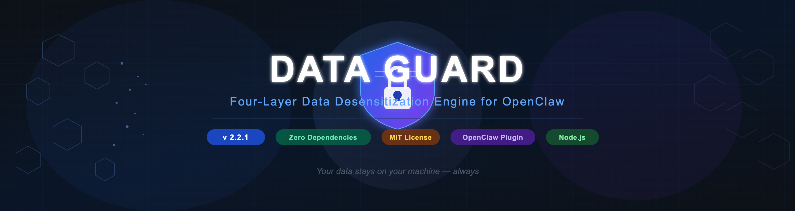
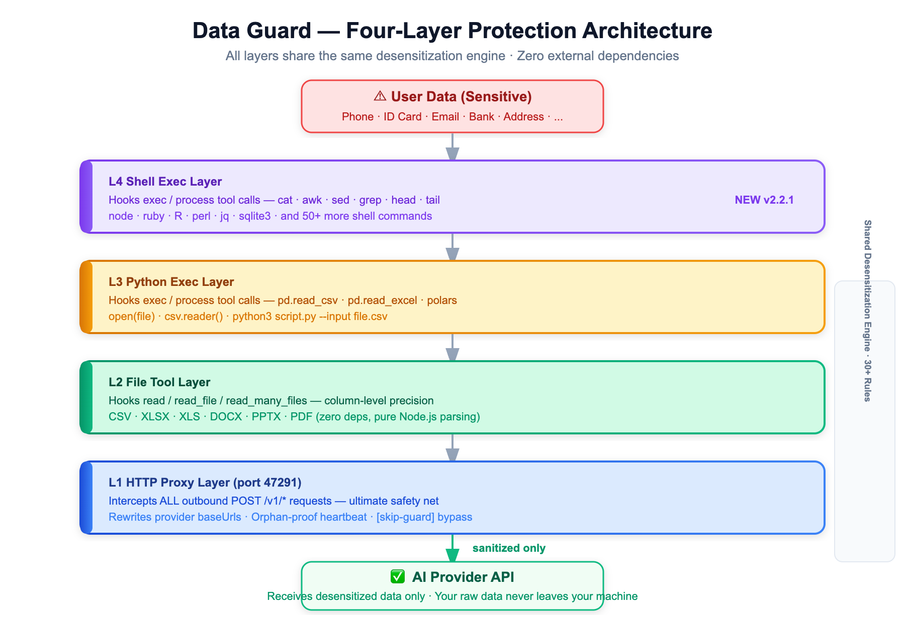
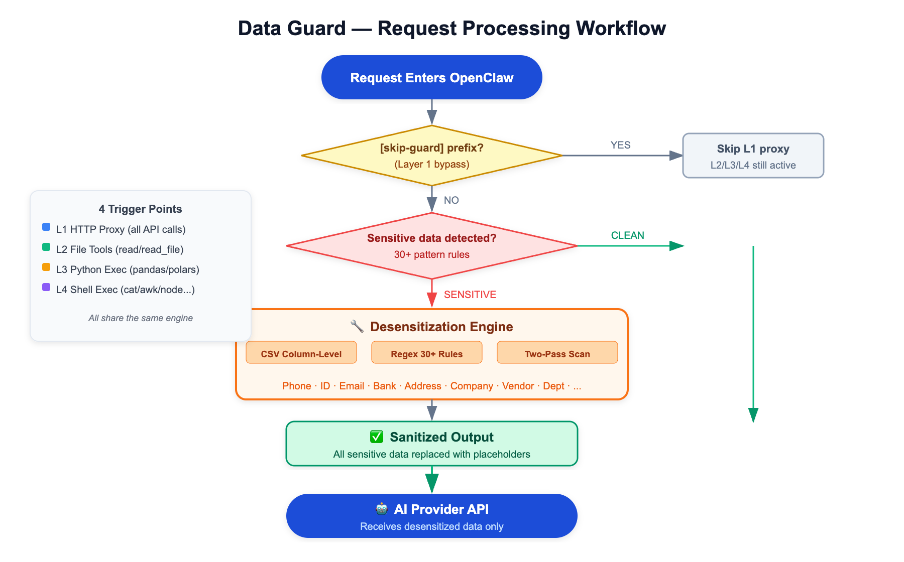

<p align="center">
  
</p>

<p align="center">
  
  
  
  
  
  
</p>

---

<p align="center">
  <strong>🇨🇳 中文</strong> | <strong>🇺🇸 English</strong>
</p>

---

## 🎯 产品定位 | Product Positioning

> **专为中小型金融机构、创投企业打造的隐私合规开源解决方案**
>
> **Privacy-First AI Solution for Financial & VC Institutions**

在使用 **龙虾 (OpenClaw)** 🦞 调用外部大模型（GPT-4、Claude、DeepSeek 等）时，**Data Guard** 确保您的客户数据、投资组合信息、尽调资料等敏感内容在**本地完成脱敏**，绝不上传到第三方 AI 服务商。

When using **OpenClaw** 🦞 to invoke external LLMs (GPT-4, Claude, DeepSeek, etc.), **Data Guard** ensures your client data, portfolio information, and due diligence materials are **desensitized locally** before any data leaves your machine.

| | |
|:---|:---|
| **版本 Version** | 2.3.0 |
| **插件 ID Plugin ID** | `data-guard` |
| **引擎 Engine** | Pure Node.js — 零外部依赖 zero external dependencies |
| **平台 Platform** | macOS · Linux · Windows |
| **许可证 License** | MIT |
| **加密 Encryption** | AES-256-GCM 可逆加密 / Reversible Encryption |

---

## 🏦 适用场景 | Use Cases

| 场景 Scenario | 风险 Risk | 解决方案 Solution |
|:--|:--|:--|
| 投行分析师用 AI 处理客户财务报表 | 客户姓名、银行卡号泄露 | 自动识别并脱敏金融数据 |
| 创投机构上传被投企业尽调资料 | 商业机密、创始人身份证号外泄 | 本地预处理，零上云 |
| 基金公司批量处理投资人信息 | 手机号、地址等 PII 暴露 | 列级精准脱敏 CSV/Excel |
| 合规审计要求数据不出境 | 跨境数据传输风险 | 本地脱敏引擎，无需联网 |

---

## ⚡ 四层架构 | Four-Layer Architecture

<p align="center">
  
</p>

| 层级 Layer | 触发点 Trigger | 覆盖范围 Coverage |
|:-----------|:---------------|:------------------|
| 🟣 **L4: Shell 执行层 Shell Exec** | `exec` / `process` — shell 命令 | `cat` · `awk` · `sed` · `grep` · `head` · `tail` · `node` · `ruby` · `R` · `perl` · `jq` · `sqlite3` 等 50+ 命令 |
| 🟡 **L3: Python 执行层 Python Exec** | `exec` / `process` — Python 命令 | `pd.read_csv` · `pd.read_excel` · `polars` · `open(file)` · `csv.reader` · `python3 script.py` |
| 🟢 **L2: 文件工具层 File Tool** | `read`, `read_file`, `read_many_files` | CSV / XLSX / XLS / DOCX / PPTX / PDF，支持列级精准脱敏 |
| 🔵 **L1: HTTP 代理层 HTTP Proxy** | 所有 outbound `POST /v1/*` API 调用 | 所有发送给模型的文本 — 终极安全网 |

> 四层共享**同一脱敏引擎**，规则完全一致，无重复逻辑，无一致性风险。
>
> All four layers share the **same desensitization engine** with identical rules. No duplicated logic, no inconsistency.

---

## 🔄 工作流程 | Workflow

<p align="center">
  
</p>

---

## 🛡️ 支持的数据类型 | Supported Data Types

**30+ 类敏感数据**自动识别并脱敏 | **30+ categories** of sensitive data are recognized and masked:

---

## 🚀 快速开始 | Quick Start

```bash
# 1. 克隆并打包 | Clone and pack
git clone https://github.com/AlanSong2077/openclaw-plugins-data-guard.git
cd openclaw-plugins-data-guard
npm pack

# 2. 安装到 OpenClaw | Install into OpenClaw
openclaw plugins install data-guard-2.2.1.tgz

# 3. 重启网关 | Restart gateway
openclaw gateway restart

# 4. 验证 | Verify
openclaw plugins list
# data-guard   loaded   2.2.1 ✅
```

---

## ⚙️ 配置选项 | Configuration

| 选项 Option | 类型 Type | 默认值 Default | 说明 Description |
|:------------|:----------|:---------------|:-----------------|
| `port` | integer | `47291` | 本地 HTTP 代理监听端口 Proxy port |
| `blockOnFailure` | boolean | `true` | 脱敏失败时阻断请求 Block request on failure |
| `fileGuard` | boolean | `true` | 启用 L2 文件脱敏 Enable file desensitization |
| `pythonGuard` | boolean | `true` | 启用 L3 Python 脱敏 Enable Python exec desensitization |
| `shellGuard` | boolean | `true` | 启用 L4 Shell 脱敏 Enable Shell exec desensitization |
| `skipPrefix` | string | `[skip-guard]` | 绕过 L1 文本脱敏的前缀 Prefix to bypass L1 |

### 环境变量 | Environment Variables

| 变量 Variable | 默认值 Default | 说明 Description |
|:--------------|:---------------|:-----------------|
| `DATA_GUARD_PORT` | `47291` | 代理端口（覆盖配置）Proxy port override |
| `DATA_GUARD_BLOCK_ON_FAILURE` | `true` | 故障安全模式 Fail-safe mode |
| `OPENCLAW_DIR` | `~/.openclaw` | OpenClaw 配置目录 Config directory |

---

## 🔄 孤儿进程保护 | Orphan Process Protection

代理作为网关的**子进程**运行，双重机制确保不会成为孤儿进程：

The proxy runs as a **child process** of the gateway. Two mechanisms ensure it never becomes orphaned:

| 机制 Mechanism | 位置 Side | 说明 Description |
|:---------------|:----------|:-----------------|
| ❤️ **心跳检测 Heartbeat** | 代理 Proxy | 每 5 秒检测父进程，父进程消失则自动退出 Every 5s checks parent via `process.kill(ppid, 0)`. Shuts down if parent is gone. |
| 🧹 **PID 清理 PID Cleanup** | 插件 Plugin | 每次 `start()` 杀死残留进程 On every `start()`, kills stale process before spawning a new one. |
| 🗑️ **旧版本清理 Legacy Cleanup** | 插件 Plugin | 每次 `register()` 移除旧版本钩子 On every `register()`, removes hooks from older Data Guard versions. |

---

## 🔐 统一加密入口 | Unified Encryption Entry

**v2.3.0 新增** — 所有输入输出现在都通过统一加密入口处理：

**NEW in v2.3.0** — All input/output now goes through a unified encryption gateway:

```
┌─────────────────────────────────────────────────────────────────────────┐
│                        UnifiedEncryptionGuard                           │
│                         统一加密入口                                     │
├─────────────────────────────────────────────────────────────────────────┤
│  Input (输入)                                                           │
│    ├── HTTP 请求体 Request Body                                         │
│    ├── 文件内容 File Content (CSV/XLSX/DOCX/PDF...)                    │
│    ├── Python exec 命令 Python Commands                                 │
│    └── Shell exec 命令 Shell Commands                                   │
│                              │                                          │
│                              ▼                                          │
│                    ┌─────────────────┐                                  │
│                    │  encryptInput() │                                  │
│                    │   统一加密入口   │                                  │
│                    └────────┬────────┘                                  │
│                             │                                           │
│              ┌──────────────┼──────────────┐                           │
│              ▼              ▼              ▼                           │
│        ┌─────────┐   ┌──────────┐   ┌──────────┐                      │
│        │  Block  │   │Reversible│   │  Pass    │                      │
│        │  阻断   │   │  加密    │   │  放行    │                      │
│        └────┬────┘   └────┬─────┘   └────┬─────┘                      │
│             │             │              │                             │
│             ▼             ▼              ▼                             │
│        [拦截请求]    [加密后放行]    [无敏感数据]                       │
│                                                               │        │
│              LLM 处理 / LLM Processing                        │        │
│                                                               ▼        │
│                                                    ┌──────────────┐    │
│                                                    │decryptOutput()│    │
│                                                    │  统一解密出口  │    │
│                                                    └──────────────┘    │
│                                                           │            │
│  Output (输出)                                            ▼            │
│    └── 解密后的响应 Decrypted Response ◄────────────────────┘           │
└─────────────────────────────────────────────────────────────────────────┘
```

### 两种工作模式 | Two Operation Modes

| 模式 Mode | 处理方式 Handling | 适用场景 Use Case |
|:----------|:------------------|:------------------|
| **拦截阻断 Block** | 检测到敏感数据后直接拦截请求 | 极高保密要求、不可接受数据外泄的场景 |
| **可逆加密 Reversible** | AES-256-GCM 加密敏感数据后放行，LLM 返回后解密还原 | 需要 LLM 处理复杂任务、注重用户体验的场景 |

### 配置方式 | Configuration

```javascript
// 通过环境变量配置 | Via environment variables
export DATA_GUARD_MODE=reversible              # block | reversible
export DATA_GUARD_ENCRYPTION_PASSWORD=your-key  # 加密密钥

// 或在代码中 | Or in code
import { UnifiedEncryptionGuard } from './src/core/UnifiedEncryptionGuard.js';

const guard = new UnifiedEncryptionGuard({
  mode: 'reversible',                          // 'block' | 'reversible'
  encryptionPassword: 'your-secure-password',
  blockOnFailure: true,
  enabledTypes: ['email', 'phone', 'idCard', 'bankCard', 'ipAddress', 'apiKey']
});

// 统一入口加密 | Unified encryption entry
const result = guard.encryptInput(data, { source: 'http' });
if (!result.allowed) {
  console.log('Blocked:', result.reason);
}

// 统一出口解密 | Unified decryption exit
const decrypted = guard.decryptOutput(llmResponse, { source: 'http-response' });
```

---

## ⏭️ 跳过脱敏 | Skipping Desensitization

如需**跳过 L1 文本脱敏**，在消息前添加 `[skip-guard]`（可配置）。

To send a message **without** Layer 1 text desensitization, prefix it with `[skip-guard]` (configurable).

> ⚠️ L2、L3、L4（文件 / Python / Shell）**不受此前缀影响**。
>
> ⚠️ Layers 2, 3, and 4 (file / Python / Shell exec) are **unaffected** by this prefix.

---

## 🛠️ 扩展 Data Guard | Extending Data Guard

Data Guard 支持自定义文件格式和执行插件扩展。参考 `src/plugins/` 目录下的源码实现模式。

Data Guard supports extending with custom file formats and exec plugins. See the source code in `src/plugins/` for implementation patterns.

---

## 🔧 故障排查 | Troubleshooting

**端口 47291 已被占用 Port 47291 already in use** — 在 v2.2.1 中，每次 `start()` 会自动清理残留代理进程，通常无需手动处理。如需手动处理，使用 `lsof -i :47291` 查找并终止进程，然后重启网关。

> In v2.2.1, stale proxy processes are automatically cleaned up on every `start()`. If needed, use `lsof -i :47291` to find and kill the process, then restart the gateway.

**插件未加载 Plugin not loading** — 尝试重新安装：`openclaw plugins uninstall data-guard --force` 然后 `openclaw plugins install data-guard-2.2.1.tgz`。

**查看代理日志 Check proxy logs** — `tail -f ~/.openclaw/data-guard/proxy.log`

**Shell 执行层未触发 Shell exec layer not triggering** — 确保配置中 `shellGuard` 未设为 `false`。Shell 执行层仅拦截 `exec` 和 `process` 工具调用，不影响直接的 `read` / `read_file` 调用（这些由 L2 处理）。

Ensure `shellGuard` is not set to `false` in your plugin config. The Shell exec layer only intercepts `exec` and `process` tool calls — it does not affect direct `read` / `read_file` calls (those are handled by L2).

---

## 📋 更新日志 | Changelog

### v2.2.1
- **新增 NEW** 第四层 — Shell 执行脱敏 (`ShellExecPlugin`)
  - 覆盖 `cat` / `head` / `tail` / `awk` / `sed` / `grep` / `cut` / `sort` / `wc` / `diff` 等 40+ shell 命令
  - 覆盖 `node` / `ruby` / `Rscript` / `perl` / `php` / `lua` / `julia` 等语言运行时
  - 覆盖数据工具：`jq` / `yq` / `sqlite3` / `csvkit` / `xsv` / `miller`
  - 与 Python 层共享 `execUtils.js` — 路径提取和脱敏逻辑去重
- **新增 NEW** `shellGuard` 配置选项（默认 `true`）
- 更新插件清单版本至 `2.2.1`

### v2.1.0
- 新增第三层 — Python 执行脱敏 (`PythonExecPlugin`)
- 新增 `pythonGuard` 配置选项
- 新增 `migrate/cleanLegacy.js` — 安装时移除旧版本钩子

### v2.0.6
- 新增第一层和第二层：HTTP 代理 + 文件工具脱敏
- 为代理进程添加防孤儿心跳机制
- 支持 DOCX / PPTX / PDF 解析（零依赖）

---

## 🤝 贡献者 | Contributing

- **keyuzhang838-dotcom** — 贡献 Hook Plugins 模块

---

## 👥 作者 | Authors

| | |
|:--|:--|
| **Alan Song** | 主开发者 Lead Developer |
| **Roxy Li** | 贡献者 Contributor |

---

## 📄 许可证 | License

MIT License

---

<p align="center">
  <strong>🛡️ 您的数据永远留在本地 | Your data stays on your machine — always</strong>
  <br><br>
  
  
  
  
  
</p>

<p align="center">
  <sub>为隐私而生 · 为安全而设计 | Built for privacy · Designed for security</sub>
</p>
